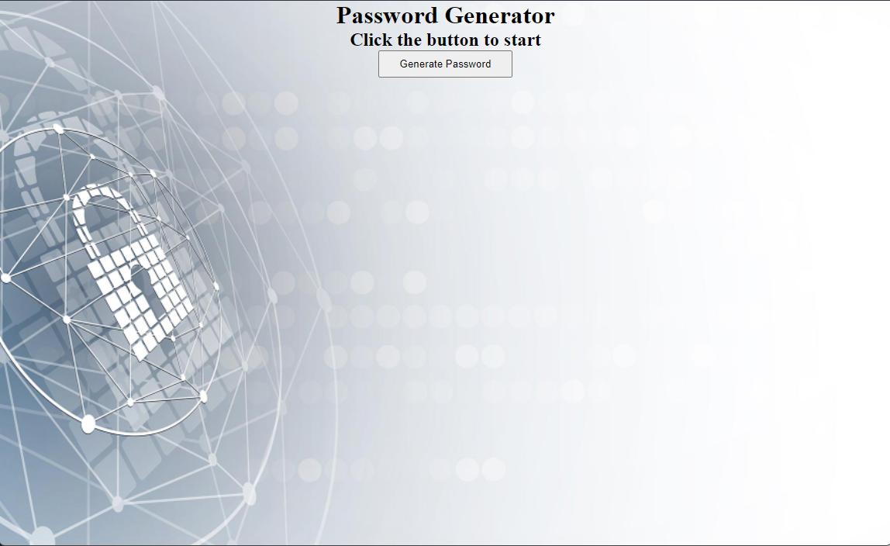

# HW-Password-Generator

## Functionality:

* When button to generate password is clicked, user is prompted for password criteria
* First the user is prompted for the length of the password which needs to be between 8 and 128 characters.
* Then the user is asked if they would like to include lowercase, uppercase, numeric and/or special characters
* At least one character type is required to proceed
* When all prompts are answered a password is genered and displated in an alert

## Mock-Up

The following image shows the web application's appearance and functionality:

